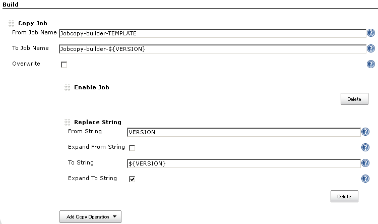
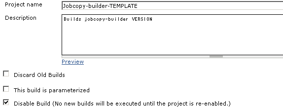
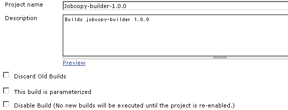
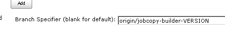
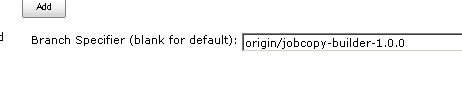

This plugin adds "Copy Job" as a build step.You can select how to
retrieve choices, including the way to share choices among all jobs.

[[JobcopyBuilderplugin-What'sthis?]]
== What's this?

This plugin provides a Copy Job build step:

* It makes a new job from an existing job.
** You can copy multiple jobs in one build execution with specifying
multiple Copy Job build steps.
** Can be applied to any type of jobs.
* You specify following parameters.
** From Job Name
*** Variable expressions can be used.
** To Job Name
*** Variable expressions can be used.
** Overwrite
*** Specifies whether to overwrite the destination job if it already
exists.
* Additional operations can be performed when copying.
** Enable Job: Enabling the destination job if the source job is
disabled.
** Disable Job: Disabling the destination job if the source job is
enabled. ( >= 1.3.0)
** Replace String: Replace strings in a job configuration.
*** Source and destination strings can contain variable expressions.
* Additional operation can be extended by using Extension Points.

[[JobcopyBuilderplugin-Screenshots]]
== Screenshots

. You can add "Copy Job" build step. +
[.confluence-embedded-file-wrapper]##
. "Copy Job" performs additional operations. Replacing strings in the
configuration, enabling a disabled job.
* The job copied from +
[.confluence-embedded-file-wrapper]##
* The job copied to. String "VERSION" is replaced, and the job is
enabled. +
[.confluence-embedded-file-wrapper]##
. Replacing strings can be applied to any part of configurations,
including that of plugins. This is a example that the branch field of
Git plugin is replaced.
* The job copied from. +
[.confluence-embedded-file-wrapper]##
* The job copied to. String "VERSION" is replaced. +
[.confluence-embedded-file-wrapper]##

[[JobcopyBuilderplugin-Howdoesthiswork?]]
== How does this work?

This plugin works as following:

. Reads the configuration xml (config.xml) of the copying job.
. Applies the operations to the configuration xml string.
. Create a new job with the processed configuration xml string.

[[JobcopyBuilderplugin-Extensionpoint]]
== Extension point

A new way to provide choices can be added with implementing
`+JobcopyOperation+`, overriding the following method:

[source,syntaxhighlighter-pre]
----
public String perform(String xmlString, String encoding, EnvVars env, PrintStream logger);
----

or, with extending `+AbstractXmlJobcopyOperation+`, overriding the
following method:

[source,syntaxhighlighter-pre]
----
abstract public Document perform(Document doc, EnvVars env, PrintStream logger);
----

[[JobcopyBuilderplugin-Usedwithpromotedbuilds]]
== Used with promoted builds

When used with
https://wiki.jenkins.io/display/JENKINS/Promoted+Builds+Plugin[Promoted
Builds Plugin], the configurations of promotions are not copied for they
are not stored in config.xml. +
Do as followings:

* Click "Advanced" in "copy Job"
* Add "Additional File Sets", specify "promotions/*/config.xml" in
"Files".

[[JobcopyBuilderplugin-Permissionstocopyjobs]]
== Permissions to copy jobs

* "Copy Job" build step requires following permissions.
+
[cols=",,",options="header",]
|===
|Target Job |Required permissions |Notes
|Item to copy from |Job/Read, Job/ExtendedRead |Job/ExtendedRead is
displayed only when you install
https://wiki.jenkins.io/display/JENKINS/Extended+Read+Permission+Plugin[Extended
Read Permission Plugin]. You can grant it by granting Job/Configure
instead.

|Item to copy to (when create) |Job/Create | 

|Item to copy to (when overwrite) |Job/Read, Job/Configure | 
|===
* "Copy Job" is run as ANONYMOUS as default.
** If you want "Copy Job" run as a specific user, use other plugins
authenticate builds. e.g.
https://wiki.jenkins.io/display/JENKINS/Authorize+Project+plugin[Authorize
Project plugin]

[[JobcopyBuilderplugin-Issues]]
== Issues

To report a bug or request an enhancement to this plugin please create a
ticket in JIRA (you need to login or to sign up for an account). Also
have a look on
https://wiki.jenkins.io/display/JENKINS/How+to+report+an+issue[How to
report an issue]

* https://issues.jenkins-ci.org/secure/CreateIssueDetails!init.jspa?pid=10172&issuetype=1&components=17506&priority=4&assignee=ikedam[Bug
report]
* https://issues.jenkins-ci.org/secure/CreateIssueDetails!init.jspa?pid=10172&issuetype=4&components=17506&priority=4[Request
or propose an improvement of existing feature]
* https://issues.jenkins-ci.org/secure/CreateIssueDetails!init.jspa?pid=10172&issuetype=2&components=17506&priority=4[Request
or propose a new feature]

[[refresh-module--1766029697]]
[[refresh--1766029697]][[jira-issues--1766029697]]
Key

T

P

Summary

[.refresh-action-group]# #

[[refresh-issues-loading--1766029697]]
[.aui-icon .aui-icon-wait]#Loading...#

[#refresh-issues-button--1766029697]##
[#refresh-issues-link--1766029697]#Refresh#
[#error-message--1766029697 .error-message .hidden]# #

[[JobcopyBuilderplugin-ChangeLog]]
== Change Log

[[JobcopyBuilderplugin-Version1.4.0(Jul24,2016)]]
=== Version 1.4.0 (Jul 24, 2016)

* Targets Jenkins 1.532. (was 1.480.3 till 1.3.0)
* Improved permission checks
(https://issues.jenkins-ci.org/browse/JENKINS-36672[JENKINS-36672])
** Jobcopy build step is authorized as anonymous when the build is run
as SYSTEM (that is, if not authorization for the job is not configured)
** Requires EXTENTED_READ (or CONFIGURE) permission to read job
configurations.
** See
https://wiki.jenkins.io/display/JENKINS/Jobcopy+Builder+plugin#JobcopyBuilderplugin-Permissionstocopyjobs[#Permissions
to copy jobs] for details.

[[JobcopyBuilderplugin-Version1.3.0(May24,2015)]]
=== Version 1.3.0 (May 24, 2015)

* Added "Disable Job" operation
(https://issues.jenkins-ci.org/browse/JENKINS-28439[JENKINS-28439])

[[JobcopyBuilderplugin-Version1.2.0(Sep11,2014)]]
=== Version 1.2.0 (Sep 11, 2014)

* Changed target Jenkins version from 1.466 to 1.480.3.
* Supports
https://wiki.jenkins.io/display/JENKINS/CloudBees+Folders+Plugin[CloudBees
Folders Plugin]
(https://issues.jenkins-ci.org/browse/JENKINS-24515[JENKINS-24515])
** You can copy a job in a folder into another folder.
** You can copy folders.

[[JobcopyBuilderplugin-Version1.1.2(Dec22,2013)]]
=== Version 1.1.2 (Dec 22, 2013)

* FIXED: Build results page shows wrong link for Copied To and Copied
From (https://issues.jenkins-ci.org/browse/JENKINS-21080[JENKINS-21080])

[[JobcopyBuilderplugin-Version1.1.1(Aug31,2013)]]
=== Version 1.1.1 (Aug 31, 2013)

* Fixed a problem with overwriting multi-configuration projects.
** combination filter was not removed even when it is removed in the
source project.

[[JobcopyBuilderplugin-Version1.1.0(Feb27,2013)]]
=== Version 1.1.0 (Feb 27, 2013)

* Added advanced configuration to copy additional files.
** Useful for plugins that does not store configurations in config.xml
of the job.
** For example, you can copy configurations of
https://wiki.jenkins.io/display/JENKINS/Promoted+Builds+Plugin[Promoted
Builds Plugin].

[[JobcopyBuilderplugin-Version1.0.1(Feb06,2013)]]
=== Version 1.0.1 (Feb 06, 2013)

* Improved overwrite behavior
** Version 1.0.0: delete the old job, and create a new job. Also builds
are deleted.
** Version 1.0.1 and later: update the configuration. Builds are
preserved.
* expand "From Job Name" field

[[JobcopyBuilderplugin-Version1.0.0(Jan14,2013)]]
=== Version 1.0.0 (Jan 14, 2013)

* Initial release.
